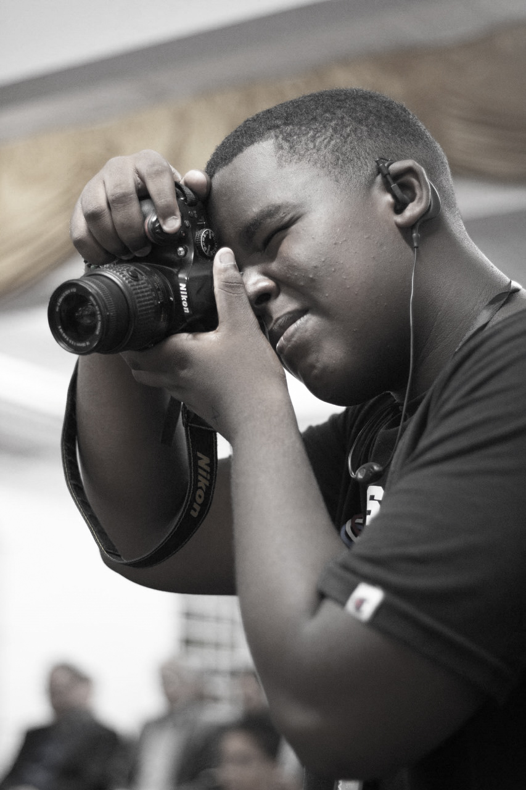

# 📸 Portfólio Pedro Campos - Produtor Audiovisual

> **Portfólio profissional moderno e responsivo para Pedro Campos, especialista em fotografia, produção de vídeos, edição e gestão de redes sociais.**



## 🎯 Sobre o Projeto

Este é um portfólio profissional desenvolvido pela **Agência de IA** para apresentar os trabalhos e serviços de Pedro Campos. O projeto utiliza tecnologias web modernas e inteligentes, criado com foco na experiência do usuário, conversão de leads e apresentação profissional dos trabalhos realizados.

**Cliente**: Pedro Campos - Produtor Audiovisual  
**Agência**: [Aiverse Technologies](https://aiverse-technologies.up.railway.app/)  
**Tipo**: Portfólio Profissional Responsivo

## ✨ Características Principais

- 🎨 **Design Moderno**: Interface elegante com tema escuro e acentos dourados
- 📱 **Totalmente Responsivo**: Adaptado para todos os dispositivos (desktop, tablet, mobile)
- ⚡ **Performance Otimizada**: Carregamento rápido e navegação fluida
- 🎭 **Animações Suaves**: Efeitos visuais e transições elegantes
- 🔍 **Portfólio Interativo**: Galeria com filtros por categoria
- 📞 **Integração WhatsApp**: Formulário de contato direto
- 🌐 **Links Sociais**: Conexão direta com Instagram e outras redes

## 🛠️ Tecnologias Utilizadas

- **HTML5** - Estrutura semântica e acessível
- **CSS3** - Estilos modernos com Flexbox, Grid e animações
- **JavaScript ES6+** - Interatividade e funcionalidades dinâmicas
- **Font Awesome** - Ícones profissionais
- **Google Fonts** - Tipografia (Inter, Playfair Display)

## 📁 Estrutura do Projeto

```
PortFolio-Pedro/
├── index.html              # Página principal
├── img/                    # Imagens do portfólio
│   ├── pedro-foto.jpg      # Foto profissional
│   ├── Trabalho1.png       # Exemplos de trabalhos
│   ├── Trabalho2.png
│   ├── Trabalho3.png
│   ├── Trabalho4.png
│   ├── Trabalho5.png
│   └── Trabalho6.png
├── video/                  # Vídeos de demonstração
│   ├── Videotrabalho.mp4
│   └── Videotrabalho2.mp4
└── README.md              # Documentação do projeto
```

## 🎨 Seções do Site

### 1. **Hero Section**
- Apresentação impactante com call-to-action
- Foto profissional e slogan
- Botões de ação principais

### 2. **Sobre Mim**
- Biografia profissional
- Estatísticas e conquistas
- Experiência e especialidades

### 3. **Serviços**
- **Fotografia**: Eventos, retratos, produtos
- **Produção de Vídeos**: Corporativos, eventos, marketing
- **Edição**: Pós-produção e finalização
- **Social Media**: Gestão e criação de conteúdo

### 4. **Portfólio**
- Galeria interativa com filtros:
  - 🖼️ **Fotografia**
  - 🎬 **Vídeos**
  - ✂️ **Edição**
  - 📱 **Social Media**
- Lightbox para visualização ampliada
- Vídeos incorporados

### 5. **Contato**
- Formulário integrado com WhatsApp
- Informações de contato
- Links para redes sociais

## 🚀 Como Usar

### Instalação Local
1. Clone ou baixe o repositório
2. Abra o arquivo `index.html` em qualquer navegador moderno
3. O site funcionará completamente offline

### Deploy Online
1. Faça upload de todos os arquivos para um servidor web
2. Certifique-se de manter a estrutura de pastas
3. Acesse através do domínio configurado

## 📞 Informações de Contato

- **WhatsApp**: (21) 97930-4266
- **Instagram**: [@pedrocampos_rec](https://instagram.com/pedrocampos_rec)
- **Agência**: [Aiverse Technologies](https://aiverse-technologies.up.railway.app/)

## 🎯 Funcionalidades Técnicas

- **Navegação Suave**: Scroll behavior e âncoras
- **Menu Responsivo**: Hamburger menu para mobile
- **Filtros Dinâmicos**: JavaScript para categorização do portfólio
- **Formulário Inteligente**: Redirecionamento automático para WhatsApp
- **Otimização de Imagens**: Carregamento otimizado
- **SEO Friendly**: Meta tags e estrutura semântica

## 🎨 Paleta de Cores

- **Fundo Principal**: #0a0a0a (Preto profundo)
- **Fundo Secundário**: #111111 (Cinza escuro)
- **Cards**: #1a1a1a (Cinza médio)
- **Texto Principal**: #ffffff (Branco)
- **Texto Secundário**: #b3b3b3 (Cinza claro)
- **Acento Dourado**: #d4af37 (Dourado elegante)
- **Acento Azul**: #4a9eff (Azul moderno)

## 📱 Compatibilidade

- ✅ Chrome 80+
- ✅ Firefox 75+
- ✅ Safari 13+
- ✅ Edge 80+
- ✅ Dispositivos móveis (iOS/Android)

## 🔧 Personalização

Para personalizar o portfólio:

1. **Imagens**: Substitua as imagens na pasta `img/`
2. **Vídeos**: Adicione novos vídeos na pasta `video/`
3. **Informações**: Edite o HTML com seus dados
4. **Cores**: Modifique as variáveis CSS no `:root`
5. **Conteúdo**: Atualize textos e descrições

## 📈 Próximas Melhorias

- [ ] Sistema de blog integrado
- [ ] Galeria de depoimentos de clientes
- [ ] Integração com Google Analytics
- [ ] Sistema de agendamento online
- [ ] Versão em inglês
- [ ] PWA (Progressive Web App)

## 🏢 Sobre a Agência

Este portfólio foi desenvolvido pela **Aiverse Technologies** como um projeto profissional para Pedro Campos. Nossa agência especializa-se em:

- 🤖 **Soluções de IA** para automação e otimização
- 💻 **Desenvolvimento Web** moderno e responsivo
- 🎨 **Design UX/UI** focado em conversão
- 📱 **Aplicações Mobile** e PWA
- 🚀 **Marketing Digital** inteligente

## 📄 Licença

Este projeto foi desenvolvido exclusivamente para Pedro Campos pela Aiverse Technologies. Todos os direitos reservados.

---

**Desenvolvido por [Aiverse Technologies](https://aiverse-technologies.up.railway.app/)**

*Projeto profissional da Aiverse Technologies — soluções web modernas e inteligentes para profissionais criativos.*